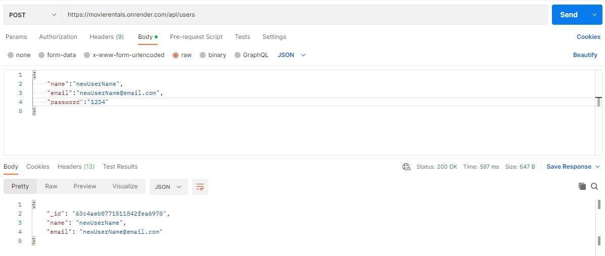
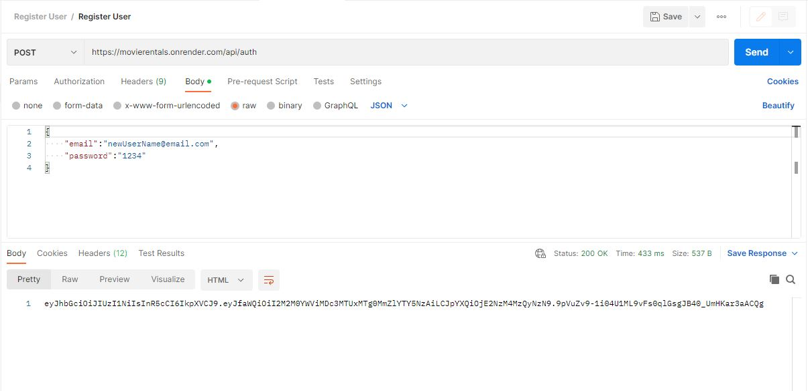
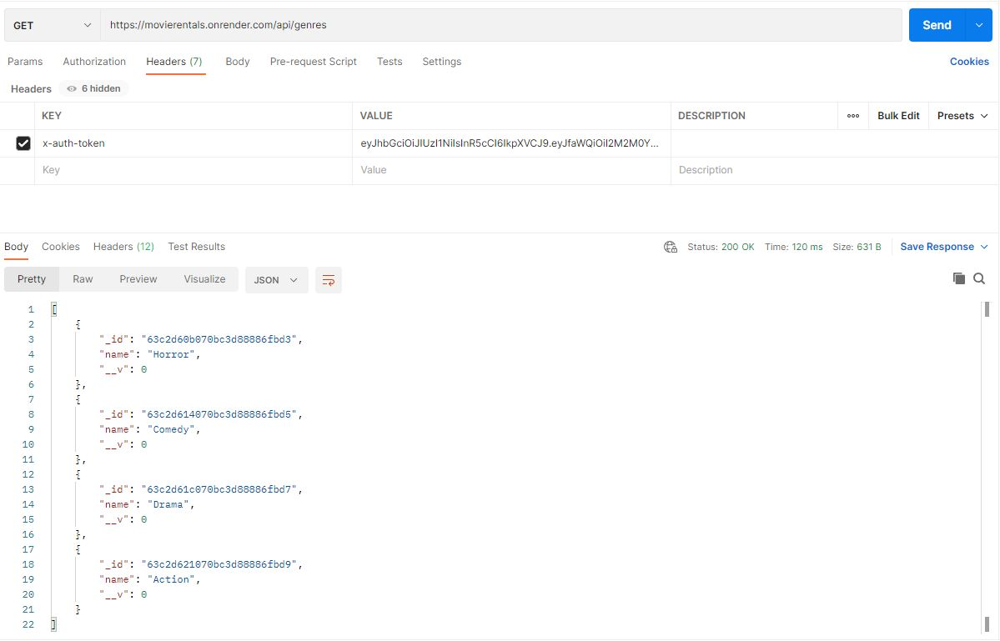

# Movie Renter API

Restful back-end API for a movie rental service. Built using Node.js, Express.js and MongoDB

<div id="badges" align="center">
  
  
</div>

### Languages and Tools

<div align="center">
  &nbsp;
  &nbsp;
  &nbsp;
  &nbsp;
  &nbsp;
  &nbsp;
</div>

## Installation

Install my-project with npm

```bash
  npm install
  cd movie-renter
```

## Running Tests

To run tests, run the following command

```bash
  npm test
```

Add you local MongoDB database to config/test.json

## Environment Variables

To run this project, you will need to add the following environment variables to your .json file

`db` For the database address

`rental_jwtPrivateKey` for authentication

## Demo

The API is hosted in on https://movierentals.onrender.com. Database is hosted in a MongoAtlas Cluster
Please allow 10-15 seconds for the API to spin active

Create a user by sending a POST request to /api/users



Login by sending login info to /api/auth add the WebToken for subsequent operations



You can perform CRUD operations in movies, genres and customers



## Contributing

Contributions are always welcome!

Please adhere to this project's `code of conduct`.
